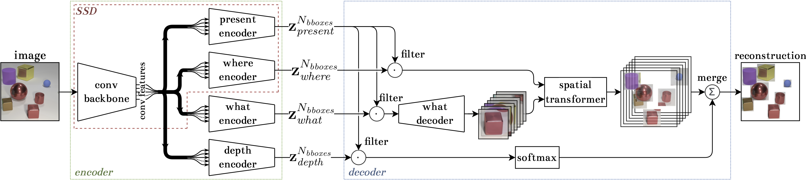

# SSDIR

Single Shot Multi-Box Detect Infer & Repeat implementation in PyTorch



## Development

Requirements:

- Install `poetry` (https://python-poetry.org/docs/#installation)
- Use `poetry` to handle requirements
  - Execute `poetry add <package_name>` to add new library
  - Execute `poetry install` to create virtualenv and install packages

## Training

To train the model use the `train.py` script. Activate the environment by running `poetry shell` and run `python train.py --help` to see all the available options. See [supplementary material](SUPPLEMENTARY.md) for details on hyperparameter settings in the research.

SSDIR re-uses trained [SSD](https://github.com/piotlinski/ssd) models and shares same datasets implementation. See the repository for more details.

## Manual

Use `make` to run commands

- `make help` - show help
- `make test` - run tests
  - `args="--lf" make test` - run pytest tests with different arguments
- `make shell` - run poetry shell

## Supplementary materials

In [supplementary materials](SUPPLEMENTARY.md) we shared more details about the model.

## Reference

If you use SSDIR in your research, please consider citing:

```
@InProceedings{10.1007/978-3-031-08757-8_51,
author="Zieli{\'{n}}ski, Piotr
and Kajdanowicz, Tomasz",
editor="Groen, Derek
and de Mulatier, Cl{\'e}lia
and Paszynski, Maciej
and Krzhizhanovskaya, Valeria V.
and Dongarra, Jack J.
and Sloot, Peter M. A.",
title="Learning Scale-Invariant Object Representations with a Single-Shot Convolutional Generative Model",
booktitle="Computational Science -- ICCS 2022",
year="2022",
publisher="Springer International Publishing",
address="Cham",
pages="613--626",
abstract="Contemporary machine learning literature highlights learning object-centric image representations' benefits, i.e. interpretability, and the improved generalization performance. In the current work, we develop a neural network architecture that effectively addresses the task of multi-object representation learning in scenes containing multiple objects of varying types and sizes. In particular, we combine SPAIR and SPACE ideas, which do not scale well to such complex images, and blend them with recent developments in single-shot object detection. The method overcomes the limitations of fixed-scale glimpses' processing by learning representations using a feature pyramid-based approach, allowing more feasible parallelization than all other state-of-the-art methods. Moreover, the method can focus on learning representations of only a selected subset of types of objects coexisting in scenes. Through a series of experiments, we demonstrate the superior performance of our architecture over SPAIR and SPACE, especially in terms of latent representation and inferring on images with objects of varying sizes.",
isbn="978-3-031-08757-8"
}

```

